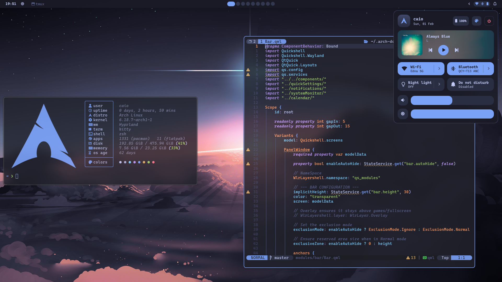
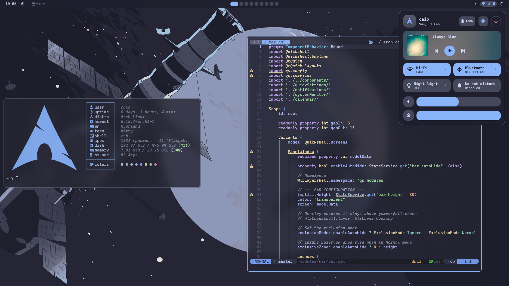
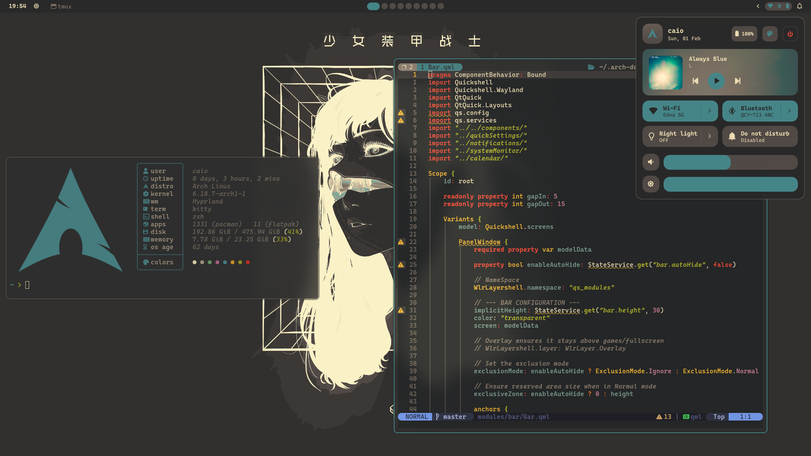
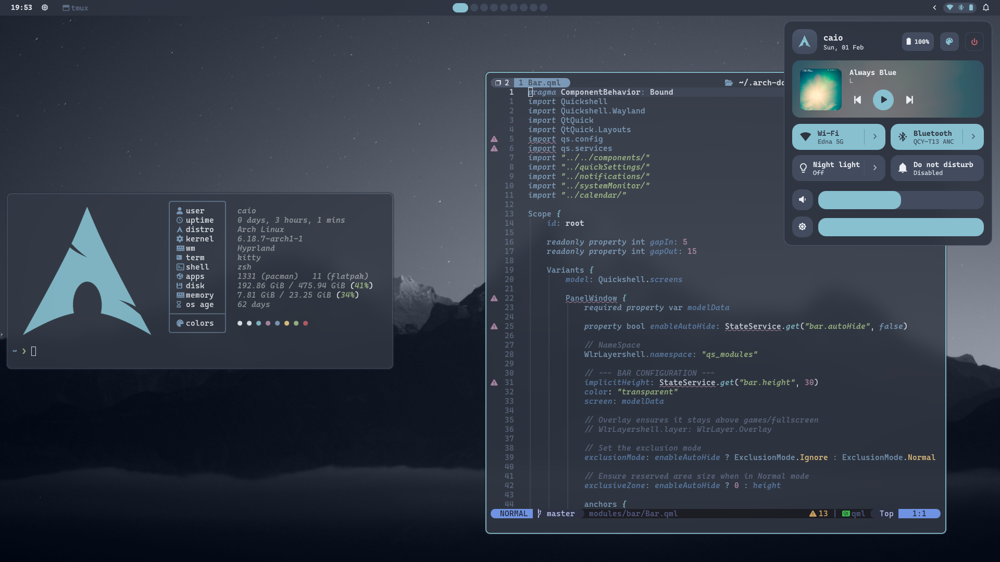
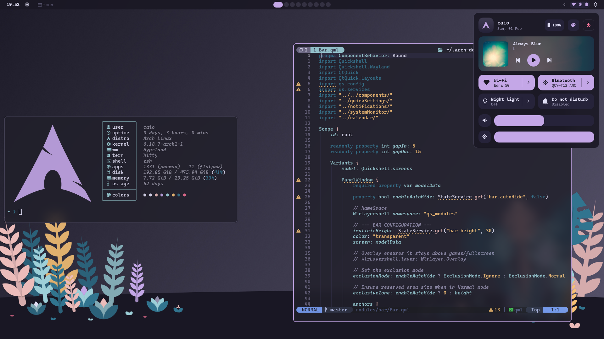

# Arch Dots

Arch Linux dotfiles managed with [GNU Stow](https://www.gnu.org/software/stow/), featuring a Hyprland (Wayland) desktop environment with a custom QuickShell bar and a unified theme system that applies across the entire setup.

## Screenshots

### Tokyo Night


### Catppuccin Mocha


### Dracula


### Gruvbox Dark


### Nord


### Rose Pine


## Features

- **Hyprland** - Tiling Wayland compositor with modular configuration
- **QuickShell** - Custom QML-based status bar, launcher, notifications, quick settings, and power menu
- **Dynamic Theming** - 6 themes (Tokyo Night, Catppuccin Mocha, Dracula, Gruvbox, Nord, Rose Pine) applied live across the entire system: shell, terminal, editor, wallpaper, and fastfetch logo
- **Wallpaper Picker** - Built-in wallpaper manager with search, favorites, and per-theme wallpaper folders
- **Neovim** - Lua-based configuration with LSP, Telescope, Smart Splits, and lazy.nvim
- **Tmux** - Terminal multiplexer with seamless Neovim navigation (Smart Splits)
- **Kitty** - GPU-accelerated terminal with dynamic theme switching
- **Zsh** - Oh-My-Zsh with autosuggestions, syntax highlighting, vi-mode, and Powerlevel10k

### Theme System

Switching themes from the Quick Settings panel applies colors instantly to:

| Component | What changes |
| --- | --- |
| QuickShell (bar, launcher, notifications) | All UI colors |
| Kitty | Terminal colors, cursor, tabs, borders |
| Neovim | Colorscheme (sent to all running instances) |
| Hyprland | Active/inactive border colors, shadow |
| Fastfetch | Logo recolored to match accent |
| Wallpaper | Theme-linked wallpaper applied via swww |

No restarts required.

## Quick Start

```bash
git clone https://github.com/caioax/.arch-dots.git ~/.arch-dots
cd ~/.arch-dots
./install.sh
```

The installer is interactive and lets you pick which package categories to install. See [.install/README.md](.install/README.md) for advanced usage.

## Keybindings

### Apps

| Keybind | Action |
| --- | --- |
| `Super + Return` | Terminal (Kitty) |
| `Super + D` | File Manager (Dolphin) |
| `Super + Z` | Browser (Zen Browser) |
| `Super + Space` | App Launcher |

### Windows

| Keybind | Action |
| --- | --- |
| `Super + Q` | Kill window |
| `Super + F` | Fullscreen |
| `Super + Shift + F` | Fullscreen (pinned) |
| `Super + Shift + Space` | Toggle floating |
| `Super + Tab` | Toggle split |
| `Super + P` | Pseudo tile |
| `Super + H J K L` | Move focus (left/down/up/right) |
| `Super + Shift + H J K L` | Move window |
| `Super + Alt + H J K L` | Resize window |

### Workspaces

| Keybind | Action |
| --- | --- |
| `Super + 1-0` | Switch to workspace 1-10 |
| `Super + Shift + 1-0` | Move window to workspace 1-10 |
| `Super + Ctrl + H / L` | Previous / Next workspace |
| `Super + Ctrl + Shift + H / L` | Move window to prev / next workspace |
| `Super + W` | Toggle WhatsApp workspace |
| `Super + M` | Toggle Spotify workspace |
| `Super + S` | Toggle Magic workspace |

### System

| Keybind | Action |
| --- | --- |
| `Super + B` | Wallpaper Picker |
| `Super + /` | Keybinds Help |
| `Super + V` | Clipboard History |
| `Super + End` | Power Menu |
| `Print` | Screenshot |
| `Super + = / -` | Zoom in / out |
| `Super + Shift + R` | Reload QuickShell |

### Media

| Keybind | Action |
| --- | --- |
| `Volume Keys` | Volume up / down / mute |
| `Brightness Keys` | Brightness up / down |
| `Media Keys` | Play / Pause / Next / Previous |

## Structure

Each top-level directory is a [GNU Stow](https://www.gnu.org/software/stow/) package that gets symlinked into `$HOME`.

| Directory | Description |
| --- | --- |
| `hyprland/` | Hyprland compositor config (appearance, keybinds, rules) |
| `quickshell/` | QML shell: bar, launcher, notifications, quick settings |
| `nvim/` | Neovim config with lazy.nvim plugin manager |
| `tmux/` | Tmux config with TPM and Smart Splits integration |
| `kitty/` | Kitty terminal config with dynamic themes |
| `zsh/` | Zsh config with Oh-My-Zsh and Powerlevel10k |
| `local/` | Custom scripts, wallpapers (`~/.local/wallpapers/`), and themes (`~/.local/themes/`) |
| `fastfetch/` | System info display config and dynamic logo |
| `theming/` | GTK3/4 and Qt5/6 theme settings |
| `kde/` | KDE Plasma global settings (colors, icons, fonts) |

### Other Directories

| Directory | Description |
| --- | --- |
| `.install/` | Installation scripts and package lists |
| `.data/` | Templates, default themes, and default wallpapers |

## Tech Stack

| Component | Tool |
| --- | --- |
| Compositor | Hyprland |
| Session Manager | UWSM |
| Shell/Bar | QuickShell |
| Terminal | Kitty |
| Shell | Zsh + Oh-My-Zsh |
| Multiplexer | Tmux |
| Editor | Neovim |
| Wallpaper | swww |
| File Manager | Dolphin |
| Browser | Zen Browser |
| AUR Helper | yay |
| Dotfile Manager | GNU Stow |

## Customization

Machine-specific configs are kept in `~/.config/hypr/local/` and are not tracked by git. The install script generates these from templates in `.data/hyprland/templates/` on first run:

- `monitors.conf` - Monitor layout
- `workspaces.conf` - Workspace mapping
- `extra_environment.conf` - Local environment variables
- `autostart.conf` - Local autostart programs
- `extra_keybinds.conf` - Local keybinds

### Wallpapers

Wallpapers live in `~/.local/wallpapers/` (git-ignored, defaults copied on install) and are managed through the QuickShell wallpaper picker (`Super + B`). Features include:

- **Search** by filename
- **Favorites** with persistent state
- **Theme wallpapers** organized in `~/.local/wallpapers/themes/{theme-name}/`
- Each theme can have multiple wallpapers; the active one is set from the picker and applied automatically on theme switch

### Adding Themes

Themes are JSON files in `~/.local/themes/` (git-ignored, defaults copied from `.data/themes/` on install). Each theme defines colors for the palette, terminal, Hyprland, Neovim, and an optional wallpaper path. To create a new theme, copy an existing one and modify the values.
